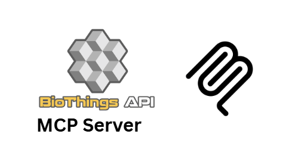

# Unofficial BioThings.io MCP Server

A Model Context Protocol (MCP) server that provides access to the BioThings.io ecosystem of APIs, including MyGene.info and MyVariant.info. This server enables seamless integration of comprehensive gene and variant annotation data into your workflows.

**Developed by [Augmented Nature](https://augmentednature.ai)**

## Overview

BioThings.io provides high-performance APIs for biological data:
- **MyGene.info**: Gene annotation service with 11M+ requests/month, covering 22M+ genes across 22K+ species
- **MyVariant.info**: Variant annotation service with 5M+ requests/month, covering 400M+ human variants

## Features

### Core Gene Tools
- **get_gene_annotation**: Retrieve detailed gene annotation by Entrez or Ensembl ID
- **query_genes**: Search genes using flexible syntax (symbols, names, genomic intervals, etc.)
- **batch_gene_query**: Process up to 1000 genes efficiently in a single request

### Core Variant Tools
- **get_variant_annotation**: Retrieve variant annotation by HGVS ID
- **query_variants**: Search variants using genomic ranges, rsIDs, gene names, and filters
- **batch_variant_query**: Process up to 1000 variants efficiently in a single request

### Advanced Gene Tools
- **search_genes_by_pathway**: Search genes by pathway (KEGG, Reactome, BioCarta, etc.)
- **search_genes_by_go_term**: Search genes by Gene Ontology terms (biological process, molecular function, cellular component)
- **get_gene_orthologs**: Find orthologous genes across species using HomoloGene
- **search_drug_target_genes**: Search for genes that are drug targets using PharmGKB annotations
- **get_genomic_interval_genes**: Get all genes within a specific genomic interval

### Advanced Variant Tools
- **search_variants_by_gene**: Find all variants in or near a specific gene
- **search_pathogenic_variants**: Search for pathogenic or likely pathogenic variants with clinical annotations
- **search_variants_by_population_frequency**: Search variants by population frequency thresholds

### Utility Tools
- **get_gene_metadata**: Retrieve MyGene.info API metadata and available fields
- **get_variant_metadata**: Retrieve MyVariant.info API metadata and available fields
- **get_gene_fields**: Get all available fields for gene annotation with descriptions
- **get_variant_fields**: Get all available fields for variant annotation with descriptions

## Installation

1. The server has been built and configured in your MCP settings
2. No API keys required - BioThings APIs are freely accessible
3. The server will automatically start when you use MCP tools

## Usage

### With Claude Desktop

Add to your `claude_desktop_config.json`:

```json
{
  "mcpServers": {
    "biothings": {
      "command": "node",
      "args": ["/path/to/biothings-server/build/index.js"]
    }
  }
}
```

### Example Queries

1. **Get gene annotation for CDK2**:
   ```
   Get detailed information about gene CDK2 using get_gene_annotation
   ```

2. **Search for insulin-related genes**:
   ```
   Search for genes related to insulin using query_genes
   ```

3. **Find genes in cell cycle pathway**:
   ```
   Find genes involved in cell cycle using search_genes_by_pathway
   ```

4. **Search genes by GO term**:
   ```
   Find genes involved in apoptosis using search_genes_by_go_term
   ```

5. **Get variant annotation**:
   ```
   Get annotation for variant chr7:g.55241707G>T using get_variant_annotation
   ```

6. **Search variants by rsID**:
   ```
   Find variant information for rs58991260 using query_variants
   ```

7. **Batch process multiple genes**:
   ```
   Get annotations for genes CDK2, TP53, and BRCA1 using batch_gene_query
   ```

8. **Find pathogenic variants**:
   ```
   Search for pathogenic variants in BRCA1 and BRCA2 genes using search_pathogenic_variants
   ```

9. **Get gene orthologs**:
   ```
   Find mouse and rat orthologs for human TP53 gene using get_gene_orthologs
   ```

10. **Search drug target genes**:
    ```
    Find genes that are targets for aspirin using search_drug_target_genes
    ```

## Query Syntax

### Gene Queries
- **Simple**: `CDK2`, `insulin receptor`
- **Fielded**: `symbol:TP53`, `entrezgene:1017`, `summary:diabetes`
- **Genomic**: `chr1:1000000-2000000`
- **Boolean**: `(CDK2 OR CDK4) AND human`
- **Wildcards**: `CDK*`, `IL?R`

### Variant Queries
- **rsID**: `rs58991260`
- **Genomic range**: `chr1:69000-70000`
- **Gene-based**: `dbnsfp.genename:BRCA1`
- **Functional**: `cadd.phred:>20`
- **Clinical**: `clinvar.clinical_significance:pathogenic`

## Available Fields

### Gene Fields (Examples)
- `symbol`, `name`, `summary` - Basic gene information
- `go.BP`, `go.MF`, `go.CC` - Gene Ontology terms
- `pathway.kegg`, `pathway.reactome` - Pathway information
- `refseq.rna`, `refseq.protein` - RefSeq identifiers
- `ensembl.gene`, `ensembl.transcript` - Ensembl identifiers

### Variant Fields (Examples)
- `cadd.phred`, `cadd.raw` - CADD scores
- `dbnsfp.genename`, `dbnsfp.aa.alt` - dbNSFP annotations
- `clinvar.clinical_significance` - ClinVar classifications
- `dbsnp.rsid`, `dbsnp.vartype` - dbSNP information
- `exac.af`, `gnomad.af` - Population frequencies

## Species Support

### Common Species Names
- `human`, `mouse`, `rat`, `fruitfly`, `nematode`, `zebrafish`, `thale-cress`, `frog`, `pig`

### Taxonomy IDs
- Human: `9606`
- Mouse: `10090`
- Rat: `10116`

## Error Handling

The server provides comprehensive error handling:
- **Invalid parameters**: Clear validation messages
- **API errors**: Detailed HTTP status and error information
- **Not found**: Graceful handling of missing genes/variants
- **Rate limiting**: Automatic retry logic for temporary failures

## Data Sources

### MyGene.info (32+ sources)
- NCBI Gene, Ensembl, UniProt, GO, KEGG, Reactome, PharmGKB, and more

### MyVariant.info (19+ sources)
- dbSNP, ClinVar, CADD, dbNSFP, ExAC, gnomAD, COSMIC, and more

## Performance

- **High throughput**: APIs handle millions of requests monthly
- **Batch processing**: Up to 1000 items per request
- **Caching**: Responses are cached for optimal performance
- **Pagination**: Support for large result sets
