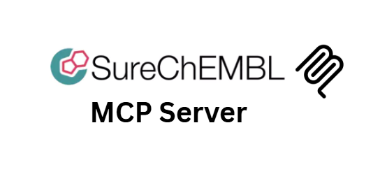

# Unofficial SureChEMBL MCP Server

A comprehensive Model Context Protocol (MCP) server for accessing the SureChEMBL chemical patent database. This server provides tools for patent search, chemical discovery, structure analysis, and patent intelligence research.

**Developed by [Augmented Nature](https://augmentednature.ai)**

## Overview

SureChEMBL is a large-scale chemical patent database that provides access to chemical structures and their associated patent documents. This MCP server enables seamless integration with SureChEMBL's API, offering powerful tools for:

- **Patent Intelligence**: Search and analyze chemical patents
- **Chemical Discovery**: Find compounds and their patent coverage
- **Prior Art Research**: Identify existing chemical disclosures
- **Competitive Analysis**: Track chemical developments by companies
- **Structure-Activity Analysis**: Correlate chemical structures with patent claims

## Features

### 🔍 Document & Patent Search (4 tools)

- `search_patents` - Search patents by text, keywords, or identifiers
- `get_document_content` - Get complete patent document content with chemical annotations
- `get_patent_family` - Get patent family members and relationships
- `search_by_patent_number` - Search by specific patent numbers

### 🧪 Chemical Search & Retrieval (4 tools)

- `search_chemicals_by_name` - Search chemicals by name or synonym
- `get_chemical_by_id` - Get detailed chemical information by SureChEMBL ID
- `search_by_smiles` - Search chemicals by SMILES structure notation
- `search_by_inchi` - Search chemicals by InChI/InChI key

### 🖼️ Structure & Visualization (2 tools)

- `get_chemical_image` - Generate chemical structure images
- `get_chemical_properties` - Get molecular properties and descriptors

### 📊 Data Export & Analysis (2 tools)

- `export_chemicals` - Bulk export chemical data (CSV/XML)
- `analyze_patent_chemistry` - Analyze chemical content in patents

### 🔬 Advanced Analysis Tools (3 tools)

- `get_chemical_frequency` - Get frequency statistics for chemicals across patent database
- `search_similar_structures` - Find structurally similar chemicals using similarity search
- `get_patent_statistics` - Get statistical overview of chemical content in patents

### 📚 Resource Templates

- `surechembl://document/{doc_id}` - Patent document content
- `surechembl://chemical/{chem_id}` - Chemical compound data
- `surechembl://family/{patent_id}` - Patent family information
- `surechembl://search/{query}` - Search results

## Installation

### Prerequisites

- Node.js 18+
- npm or yarn

### Install Dependencies

```bash
npm install
```

### Build the Server

```bash
npm run build
```

### Development Mode

```bash
npm run watch
```

## Usage

### Running the Server

```bash
npm start
```

### Using with Claude Desktop

Add to your Claude Desktop configuration file:

**macOS**: `~/Library/Application Support/Claude/claude_desktop_config.json`
**Windows**: `%APPDATA%/Claude/claude_desktop_config.json`

```json
{
  "mcpServers": {
    "surechembl-server": {
      "command": "node",
      "args": ["/path/to/surechembl-server/build/index.js"]
    }
  }
}
```

### Using with MCP Inspector

```bash
npm run inspector
```

## API Examples

### Search for Chemicals by Name

```typescript
// Search for aspirin-related compounds
await use_mcp_tool({
  server_name: "surechembl-server",
  tool_name: "search_chemicals_by_name",
  arguments: {
    name: "aspirin",
    limit: 10,
  },
});
```

### Get Patent Document Content

```typescript
// Get full patent document with chemical annotations
await use_mcp_tool({
  server_name: "surechembl-server",
  tool_name: "get_document_content",
  arguments: {
    document_id: "WO-2020096695-A1",
  },
});
```

### Generate Chemical Structure Image

```typescript
// Generate structure image from SMILES
await use_mcp_tool({
  server_name: "surechembl-server",
  tool_name: "get_chemical_image",
  arguments: {
    structure: "CC(=O)OC1=CC=CC=C1C(=O)O",
    width: 300,
    height: 200,
  },
});
```

### Analyze Patent Chemistry

```typescript
// Analyze chemical annotations in a patent
await use_mcp_tool({
  server_name: "surechembl-server",
  tool_name: "analyze_patent_chemistry",
  arguments: {
    document_id: "US-2021123456-A1",
  },
});
```

## Tool Reference

### Document & Patent Search

#### `search_patents`

Search patents by text, keywords, or identifiers.

**Parameters:**

- `query` (string, required): Search query
- `limit` (number, optional): Results limit (1-1000, default: 25)
- `offset` (number, optional): Results offset (default: 0)

#### `get_document_content`

Get complete patent document content with chemical annotations.

**Parameters:**

- `document_id` (string, required): Patent document ID (e.g., WO-2020096695-A1)

#### `get_patent_family`

Get patent family members and relationships.

**Parameters:**

- `patent_id` (string, required): Patent ID to find family members for

#### `search_by_patent_number`

Search for patents by specific patent numbers.

**Parameters:**

- `patent_number` (string, required): Patent or publication number

### Chemical Search & Retrieval

#### `search_chemicals_by_name`

Search for chemicals by name, synonym, or common name.

**Parameters:**

- `name` (string, required): Chemical name or synonym
- `limit` (number, optional): Results limit (1-1000, default: 25)

#### `get_chemical_by_id`

Get detailed chemical information by SureChEMBL chemical ID.

**Parameters:**

- `chemical_id` (string, required): SureChEMBL chemical ID (numeric)

#### `search_by_smiles`

Search for chemicals by SMILES structure notation.

**Parameters:**

- `smiles` (string, required): SMILES string
- `limit` (number, optional): Results limit (1-1000, default: 25)

#### `search_by_inchi`

Search for chemicals by InChI or InChI key.

**Parameters:**

- `inchi` (string, required): InChI string or InChI key
- `limit` (number, optional): Results limit (1-1000, default: 25)

### Structure & Visualization

#### `get_chemical_image`

Generate chemical structure image from SMILES or other structure notation.

**Parameters:**

- `structure` (string, required): SMILES string or structure notation
- `height` (number, optional): Image height in pixels (default: 200)
- `width` (number, optional): Image width in pixels (default: 200)

#### `get_chemical_properties`

Get molecular properties and descriptors for a chemical.

**Parameters:**

- `chemical_id` (string, required): SureChEMBL chemical ID

### Data Export & Analysis

#### `export_chemicals`

Bulk export chemical data in CSV or XML format.

**Parameters:**

- `chemical_ids` (array, required): Array of SureChEMBL chemical IDs (1-100)
- `output_type` (string, optional): Export format - 'csv' or 'xml' (default: csv)
- `kind` (string, optional): ID type - 'cid' or 'smiles' (default: cid)

#### `analyze_patent_chemistry`

Analyze chemical content and annotations in a patent document.

**Parameters:**

- `document_id` (string, required): Patent document ID to analyze

### Advanced Analysis Tools

#### `get_chemical_frequency`

Get frequency statistics for chemicals across the patent database.

**Parameters:**

- `chemical_id` (string, required): SureChEMBL chemical ID

#### `search_similar_structures`

Find structurally similar chemicals using similarity search.

**Parameters:**

- `reference_id` (string, required): Reference chemical ID for similarity search
- `threshold` (number, optional): Similarity threshold (0.0-1.0, default: 0.7)
- `limit` (number, optional): Number of results to return (1-100, default: 25)

#### `get_patent_statistics`

Get statistical overview of chemical content in patents.

**Parameters:**

- `document_id` (string, required): Patent document ID for statistics
- `include_annotations` (boolean, optional): Include detailed annotation statistics (default: true)

## Resource Templates

### Document Resource

```
surechembl://document/{doc_id}
```

Access complete patent document content with chemical annotations.

### Chemical Resource

```
surechembl://chemical/{chem_id}
```

Access chemical compound information and properties.

### Patent Family Resource

```
surechembl://family/{patent_id}
```

Access patent family members and relationships.

### Search Resource

```
surechembl://search/{query}
```

Access chemical search results for a query.

## Error Handling

The server includes comprehensive error handling for:

- Invalid API parameters
- Network timeouts and connection issues
- API rate limiting
- Malformed chemical structures
- Missing documents or chemicals

All errors are returned with descriptive messages and appropriate error codes.

## Rate Limiting

The server respects SureChEMBL's API rate limits:

- 30-second timeout for complex requests
- Respectful request spacing
- Automatic retry logic for transient failures

## Development

### Project Structure

```
surechembl-server/
├── src/
│   └── index.ts          # Main server implementation
├── build/                # Compiled JavaScript
├── package.json          # Dependencies and scripts
├── tsconfig.json         # TypeScript configuration
└── README.md            # This file
```

### Available Scripts

- `npm run build` - Compile TypeScript to JavaScript
- `npm run watch` - Watch mode for development
- `npm run inspector` - Run MCP inspector
- `npm start` - Start the server
- `npm run dev` - Development mode with watch

### Contributing

1. Fork the repository
2. Create a feature branch
3. Make your changes
4. Add tests if applicable
5. Submit a pull request

## License

MIT License - see LICENSE file for details.

## Support

For issues and questions:

- GitHub Issues: [Report bugs and feature requests](https://github.com/augmented-nature/surechembl-mcp-server/issues)
- Documentation: [SureChEMBL API Documentation](https://www.surechembl.org/api/)

## Related Projects

- [ChEMBL MCP Server](https://github.com/augmented-nature/chembl-mcp-server) - ChEMBL bioactivity database
- [PubChem MCP Server](https://github.com/augmented-nature/pubchem-mcp-server) - PubChem chemical database
- [UniProt MCP Server](https://github.com/augmented-nature/uniprot-mcp-server) - UniProt protein database

## Citation
If you use this project in your research or publications, please cite it as follows:

```bibtex @misc{surechemblmcp2025, 
author = {Moudather Chelbi},
title = {SureChEMBL MCP Server},
year = {2025},
howpublished = {https://github.com/Augmented-Nature/SureChEMBL-MCP-Server},
note = {Accessed: 2025-06-29}
---

**SureChEMBL MCP Server** - Empowering chemical patent intelligence through the Model Context Protocol.
